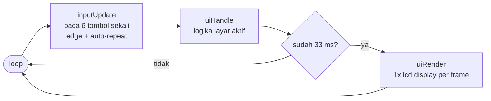
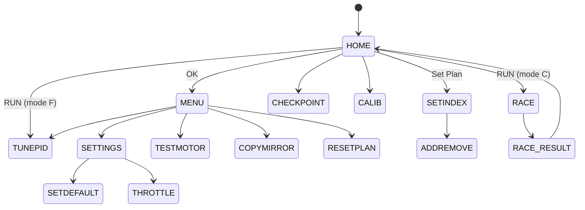
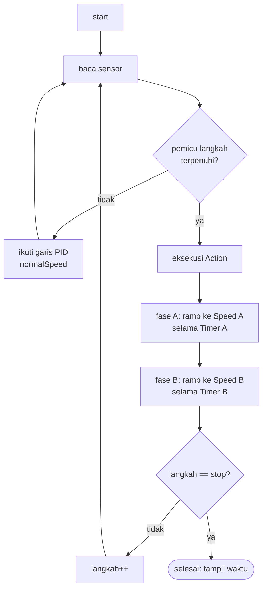

<div align="center">

# 🤖 Robot Line Follower ESP32 — EEPROM Polinema

**Line follower kompetitif berbasis ESP32 dengan _path-programming on-device_, UI OLED non-blocking, dan 7 profil PID.**
Program lintasan langsung di robot — tanpa laptop, tanpa recompile.


</div>

---

> **🔧 Status:** firmware ini telah di-**refactor total** dari arsitektur _blocking_ menjadi **non-blocking
> (cooperative state machine)** dan dimigrasikan agar **compile bersih di Arduino-ESP32 core v3.x**.
> Diverifikasi dengan `arduino-cli compile` (0 error, 0 warning).

## ✨ Sorotan Fitur

- 🧠 **Path Programming (Plan → Index → Checkpoint)** — sampai **9 plan × 100 langkah**, tiap langkah punya 14 parameter (trigger sensor, aksi, kecepatan 2-fase, PID per-segmen, timer jarak-encoder).
- 🎛️ **UI OLED non-blocking** — navigasi tab/menu responsif, tanpa _freeze_, tanpa konflik antar-menu.
- 📏 **14 sensor IR** via 2× MUX, kalibrasi **auto & manual** + pengaturan sensitivitas.
- 🎚️ **7 profil PID** yang bisa di-tune & dites _live_ di robot.
- 🏁 **Checkpoint resume** + stopwatch waktu tempuh.
- ⚫⚪ **Garis hitam & putih** didukung dalam satu lookup-table, 3 mode follow (center/kanan/kiri).
- 🔋 **Proteksi baterai** (cutoff sebelum start) + indikator persen.
- 🧰 **Tools on-device**: Test Motor, Copy/Mirror Plan, Reset Plan, Set Default, Set Throttle.

---

## 📑 Daftar Isi
1. [Quick Start](#-quick-start)
2. [Hardware](#-hardware)
3. [Arsitektur Non-Blocking](#-arsitektur-non-blocking)
4. [Peta Menu](#-peta-menu)
5. [Path Programming](#-path-programming-planindexcheckpoint)
6. [Profil PID](#-profil-pid)
7. [Apa yang Berubah di Refactor Ini](#-apa-yang-berubah-di-refactor-ini)
8. [Peta Memori](#-peta-memori)
9. [Struktur Proyek](#-struktur-proyek)
10. [Roadmap](#-roadmap)
11. [Kredit & Lisensi](#-kredit--lisensi)

---

## 🚀 Quick Start

<details open>
<summary><b>Build via arduino-cli (cara yang dipakai untuk verifikasi)</b></summary>

```bash
# 1. Pasang core ESP32 v3.x
arduino-cli config add board_manager.additional_urls https://espressif.github.io/arduino-esp32/package_esp32_index.json
arduino-cli core update-index
arduino-cli core install esp32:esp32

# 2. Pasang library
arduino-cli lib install "Adafruit GFX Library" "Adafruit SH110X" "Adafruit PCF8574" "SPIMemory"

# 3. Compile
arduino-cli compile --fqbn esp32:esp32:esp32 LineFollowerESP32_EEPROM

# 4. Upload (ganti /dev/ttyUSB0 sesuai port)
arduino-cli upload  --fqbn esp32:esp32:esp32 -p /dev/ttyUSB0 LineFollowerESP32_EEPROM
```
</details>

<details>
<summary><b>Build via Arduino IDE</b></summary>

1. **Boards Manager** → pasang `esp32 by Espressif` (versi 3.x).
2. **Library Manager** → pasang: Adafruit GFX, Adafruit SH110X, Adafruit PCF8574, SPIMemory.
3. Buka folder `LineFollowerESP32_EEPROM/`, pilih board **ESP32 Dev Module**, lalu Upload.
</details>

> ⚠️ **Setelah flash pertama**, jalankan menu **Settings → Set Default** sekali untuk menginisialisasi
> layout memori baru (`VAL_INDEX` kini 100). Lalu **Calib Sensor → Auto** untuk kalibrasi lintasan.

---

## 🔩 Hardware

| Subsistem | Komponen | Pin / Alamat |
|-----------|----------|--------------|
| **MCU** | ESP32 (240 MHz) | — |
| **Sensor garis** | 14× IR analog via 2× MUX 8-kanal (7 kiri + 7 kanan) | ADC `32` (kiri), `35` (kanan); selektor `13/14/15` |
| **Driver motor** | H-bridge (BTS7960), PWM LEDC 15 kHz / 8-bit | Kiri `26/27` · Kanan `17/16` |
| **Encoder** | 2× rotary quadrature (CPR 208, roda Ø17 mm) | Kiri `33/25` · Kanan `39/36` |
| **Display** | OLED SH1106 128×64 I²C | `0x3C` |
| **Tombol** | 6 tombol via PCF8574 (I²C expander) | `0x27` |
| **Memori lintasan** | SPI Flash Winbond 4MB (SPIMemory) | CS `5` |
| **Memori konfigurasi** | EEPROM emulasi 1 KB | — |
| **Baterai** | ADC + divider 10k/3.3k, filter EMA, cutoff 11.8 V | `34` |
| **LED status** | indikator tulis memori | `12` |

> PCB (KiCad) & model 3D tersedia di folder [`Electrical/`](Electrical) dan [`3d Model/`](3d%20Model).

---

## 🧩 Arsitektur Non-Blocking

Versi lama menjebak eksekusi di `while(1)` tiap menu (blocking) + tombol _busy-wait_ + state global dipakai
bersama → tidak responsif & sering konflik antar-menu. Versi ini memakai **loop kooperatif**:



**3 pilar yang menghilangkan blocking & konflik:**

| Pilar | Sebelum | Sesudah |
|-------|---------|---------|
| **Input** | `touchUp()` _busy-wait_ menunggu tombol dilepas | `inputUpdate()` non-blocking → event `PRESS / HOLD / RELEASE` (debounce + auto-repeat berbasis `millis()`) |
| **Render** | `clearDisplay()/display()` berserak di tiap layar | satu `lcd.display()` per frame (~30 fps) |
| **State** | global `selectSet/countMenu/halIdx` dipakai bersama | tiap layar punya **struct state lokal** + **screen stack** (push/pop) |

Navigasi antar-layar memakai state machine + stack:



> 🏁 **Mode balapan** sengaja tetap _tight loop_ real-time (deterministik untuk kontrol), namun tombol
> abort dibaca non-blocking dan **semua timing pakai `millis()`** (tanpa `delay()`), jadi abort tetap responsif.

---

## 🗺️ Peta Menu

<details open>
<summary><b>Pohon menu lengkap</b></summary>

```
HOME ── UP/DOWN pindah widget · RUN = mulai ──────────────────────────
├─ Mode C/F        C=Balapan, F=Tune PID   ·  OK → MAIN MENU
├─ Set Plan        pilih plan (1–9)         ·  OK → SET INDEX
├─ Normal Speed    ±5
├─ CHKPNT          OK → CHECKPOINT
└─ CALSEN          OK → CALIB SENSOR

MAIN MENU ── UP/DOWN · RUN = back ────────────────────────────────────
├─ Set Plan          OK → SET INDEX
├─ Calib Sensor      +:Auto   -:Manual
├─ Tuning PID        OK → TUNE PID
├─ Test Motor        OK → TEST MOTOR
├─ Copy Mirror Plan  OK → COPY/MIRROR
├─ Delete Plan       OK → RESET PLAN
└─ Settings          OK → SETTINGS (Set Default · Set Throttle)

SET INDEX ── editor langkah (list datar, 15 baris) ───────────────────
   Index · Trig SLog · Trig Logic · Action · Speed L/R · Act Delay ·
   PID Prof · Speed A · Timer A · Mode TIM · Speed B · Timer B ·
   UsedSens · FL Mode      (OK di baris "Index" → ADD/REMOVE langkah)
```
</details>

**Tombol:** `OK` pilih/masuk · `UP/DOWN` navigasi · `+ / -` ubah nilai (tahan = auto-repeat) · `RUN` kembali/mulai.

---

## 🧠 Path Programming (Plan/Index/Checkpoint)

Robot menjalankan **program lintasan** yang tersimpan, bukan sekadar mengikuti garis.

- **Plan** = satu lintasan penuh (ada **9** plan).
- **Index** = satu langkah dalam plan (ada **100** langkah/plan). Tiap langkah menyimpan:

| Parameter | Fungsi |
|-----------|--------|
| `Trig SLog` + `Trig Logic` | **Pemicu**: pola sensor + logika `OR / AND / TIM / XOR` |
| `Action` | aksi saat terpicu: `STOP/FORWARD/LEFT/RIGHT/BACKWARD/PICK/DROP/TLEFT/TRIGHT/FAN` |
| `Speed L/R` + `Act Delay` | kecepatan & durasi aksi |
| `Speed A/B` + `Timer A/B` | **2 fase kecepatan** dengan ramp berbeda |
| `Mode TIM` | sumber timer: waktu `mS` atau **jarak encoder** `CmR/CmL` |
| `PID Prof` | profil PID per-segmen (Normal..Profil 6) |
| `UsedSens` | masking sensor pinggir (All / Ignore 1–3 sisi) |
| `FL Mode` | sisi garis: `FLC` center · `FLR` kanan · `FLL` kiri |

- **Checkpoint** = titik _resume_; robot bisa lanjut balapan dari langkah tertentu (8 CP/plan).



---

## 🎚️ Profil PID

7 profil tersimpan di EEPROM, di-tune lewat **Tuning PID** (+ uji _live_ "Coba PID"):

| Profil | Kp | Ki | Kd | Target v |
|:------:|:--:|:--:|:--:|:--------:|
| Normal | 3.0 | 0.00 | 10 | 50 |
| Profil 1 | 7.0 | 0.02 | 12 | 80 |
| Profil 2 | 7.0 | 0.02 | 15 | 100 |
| Profil 3 | 7.4 | 0.04 | 35 | 120 |
| Profil 4 | 7.4 | 0.04 | 40 | 140 |
| Profil 5 | 7.4 | 0.04 | 50 | 160 |
| Profil 6 | 7.4 | 0.04 | 60 | 180 |

Hukum kontrol: `move = error·Kp + ΣError·Ki + Δerror·Kd` → `kiri = v − move`, `kanan = v + move` (clamp ±255).

---

## 🔄 Apa yang Berubah di Refactor Ini

<details>
<summary><b>🐞 Bug yang diperbaiki</b></summary>

| # | Bug | Perbaikan |
|---|-----|-----------|
| 1 | `VAL_INDEX=50` tapi UI memakai index 0–99 → **buffer overflow** | dinaikkan ke **100** + serialisasi flash diperbarui |
| 2 | Hanya 5 dari 9 plan dibaca saat boot (`readIdx` loop `<5`) | dimuat penuh `< VAL_PLAN` |
| 3 | `analogReadResolution(8)` vs kalibrasi skala 1023 | disamakan ke **10-bit** (battery ikut diperbaiki ÷1023) |
| 4 | `accelTA/accelTB` diatur tapi tak dipakai | kini **benar-benar dipakai** sebagai step ramp fase A/B |
| 5 | Transfer Plan tak terjangkau / stub | dihapus dari menu (out-of-scope) |
| 6 | `guiTestMotor` `speedsR == 255` (operator salah) | ditulis ulang dengan clamp benar |
| 7 | Duplikasi `struct Plan/CP` global (~15 KB) + bug sinkronisasi | dihapus, serialisasi via blob transien |

</details>

<details>
<summary><b>⚙️ Migrasi Arduino-ESP32 v3.x (LEDC)</b></summary>

| Lama (v2.x) | Baru (v3.x) |
|-------------|-------------|
| `ledcSetup(ch, freq, res)` + `ledcAttachPin(pin, ch)` | `ledcAttach(pin, freq, res)` |
| `ledcWrite(ch, duty)` | `ledcWrite(pin, duty)` |

Terisolasi di `motor.ino` — logika kontrol tidak berubah.
</details>

---

## 💾 Peta Memori

**EEPROM (1 KB)** — konfigurasi: home (0–3), sensitivity (4), max/min sensor (6–61), kalibrasi (62–89),
Kp/Ki/Kd (90–110), accel (111–112).

**SPI Flash 4MB** — lintasan: 9 plan × 1700 B + 9 checkpoint × 32 B ≈ **15.6 KB** (muat dalam `eraseBlock32K`).
Serialisasi memakai **blob transien** — tidak ada duplikasi RAM.

---

## 📂 Struktur Proyek

| Lapisan | File | Peran |
|---------|------|-------|
| **Entry** | `LineFollowerESP32_EEPROM.ino` | `setup()` + `loop()` (input → handle → render) |
| **Data** | `data.h`, `storage.ino` | konfigurasi, plan, checkpoint, save/load |
| **Input** | `input.h`, `input.ino` | tombol non-blocking (PCF8574) |
| **UI** | `ui.h`, `ui.ino` | state machine + dispatcher |
| **Layar** | `screens_main.ino`, `screens_index.ino`, `screens_tools.ino` | semua menu |
| **Kontrol** | `PID.ino`, `sensor.ino`, `motor.ino`, `encoder.ino`, `race.ino` | follow line + balapan |
| **Display** | `oled.h`, `oled.ino` | SH1106 + bitmap + helper gambar |
| **Util** | `timer.h` | stopwatch millis |

---

## 🛣️ Roadmap

Fitur berikut sengaja **di-tunda** (hardware belum ada / out-of-scope) agar fokus pada line follower:

- [ ] Transfer Plan (robot ↔ robot)
- [ ] Gripper & Fan (aksi `PICK/DROP/FAN` kini no-op)
- [ ] Setting Encoder (PID kecepatan)
- [ ] Wi-Fi + OTA Update
- [ ] Mode Transporter

---

## 🙏 Kredit & Lisensi

Dirancang oleh **Komunitas EEPROM Polinema** (tim G14/G15).
Refactor arsitektur non-blocking & migrasi core v3.x.

Lisensi **MIT** © 2024 [Keyzoo0](https://github.com/Keyzoo0) — lihat [LICENSE](LICENSE).

<div align="center">

⭐ _Kalau proyek ini membantu, kasih bintang ya!_ ⭐

</div>
